# Fermi — Semiconductor Detector Simulator for Photon-Counting CT

<p align="center">
  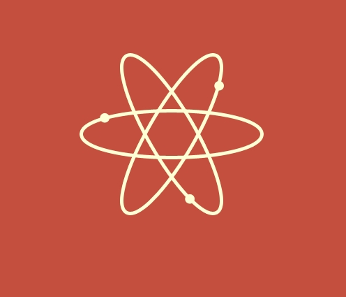
</p>

<p align="center">
  <b>Fermi</b> couples a microscopic <b>Fermi-band / carrier-transport</b> model with a macroscopic
  <b>X-ray response</b> model to evaluate semiconductor detector materials for
  <b>Photon-Counting CT (PCCT)</b> workloads in the <b>40–190 keV</b> energy band.
</p>

<p align="center">
  <a href="https://github.com/hg3992260/Fermi_PCCT/actions/workflows/windows-build.yml"></a>
  <a href="https://github.com/hg3992260/Fermi_PCCT/actions/workflows/macos-dmg.yml"></a>
  
  
</p>

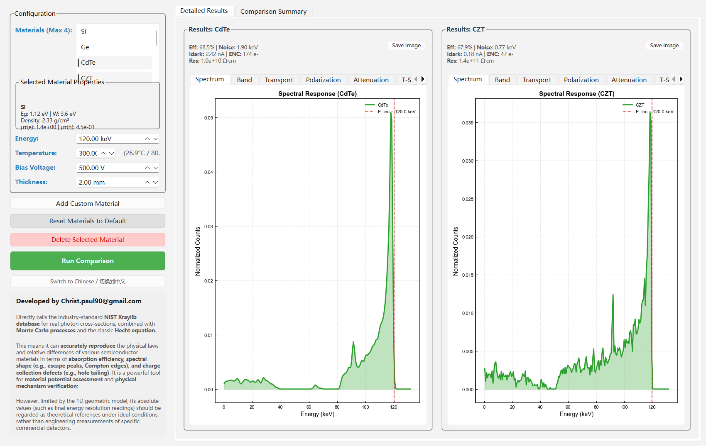

---

## Overview

Semiconductor PCCT detectors must simultaneously deliver **high absorption efficiency**, **high
count-rate capability**, and **good energy resolution** under a harsh high-flux X-ray load. Fermi
lets you explore these trade-offs for a whole library of candidate materials inside a single,
interactive desktop GUI.

The simulator combines two physics layers:

* **Fermi-band / transport layer** — intrinsic carrier concentration, Fermi level, resistivity,
  dark (shot) current and its contribution to electronic noise, plus the Hecht charge-collection
  efficiency and the space-charge / polarization field distortion.
* **X-ray response layer** — real attenuation from the **NIST Xraylib** database, depth-dependent
  photon interaction, K-edge / escape effects, and Monte-Carlo spectral generation.

The result is a physically-grounded view of **spectral response, noise, CCE, polarization,
attenuation and high-flux performance** that can be compared side-by-side across materials.

> **Scope note** — Fermi uses a 1-D geometry model. It reproduces the *relative physical laws and
> differences* between materials very well, but absolute values (e.g. final energy resolution)
> should be treated as theoretical references under ideal conditions rather than engineering
> measurements of a specific commercial detector.

---

## Features

- **Interactive desktop GUI** (PyQt6) with side-by-side multi-material comparison (up to 4 materials
  at once), English / 中文 switching, and a custom-material repository importer.
- **7 analysis panels per material**: Spectral Response, Band Structure, Charge Collection &
  Internal Field, Polarization Effect, X-ray Attenuation, Performance vs Temperature, and
  Performance vs Photon Flux.
- **PCCT Comparison Summary** with a sortable evaluation table and a 6-axis
  *PCCT Suitability Radar* (Efficiency, Speed, Resolution, Stability, High-Flux, Peak fidelity).
- **Real cross-section data** via `xraylib` (with a graceful analytic fallback when unavailable).
- **CLI entry point** for scripted batch simulation and CSV/JSON export.
- **Cross-platform packaging** through GitHub Actions (Windows `.exe` + macOS `.dmg`).

---

## Screenshots

### Detailed results & spectral response

Two materials compared at 120 keV — note the per-material statistics header
(efficiency, noise FWHM, dark current, ENC, resistivity) and the K-edge structure in the spectrum.


### PCCT comparison summary & suitability radar

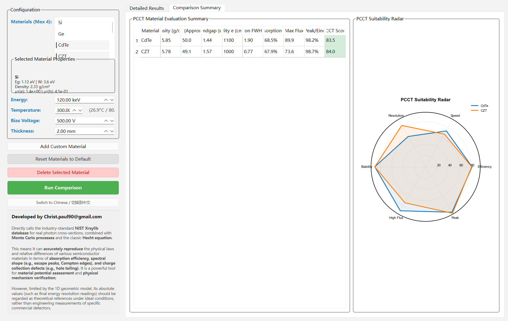

### Chinese UI

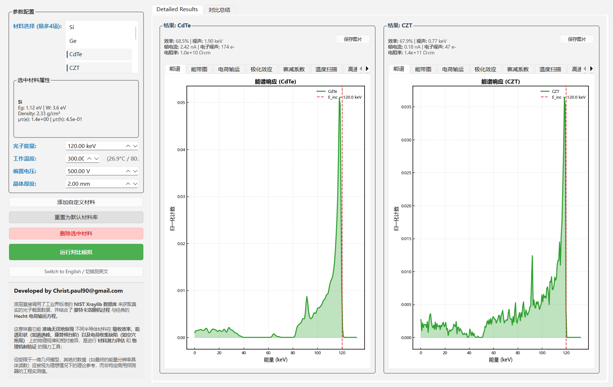

<details>
<summary><b>All analysis panels (click to expand)</b></summary>

| Panel | Plot |
|-------|------|
| Spectrum | 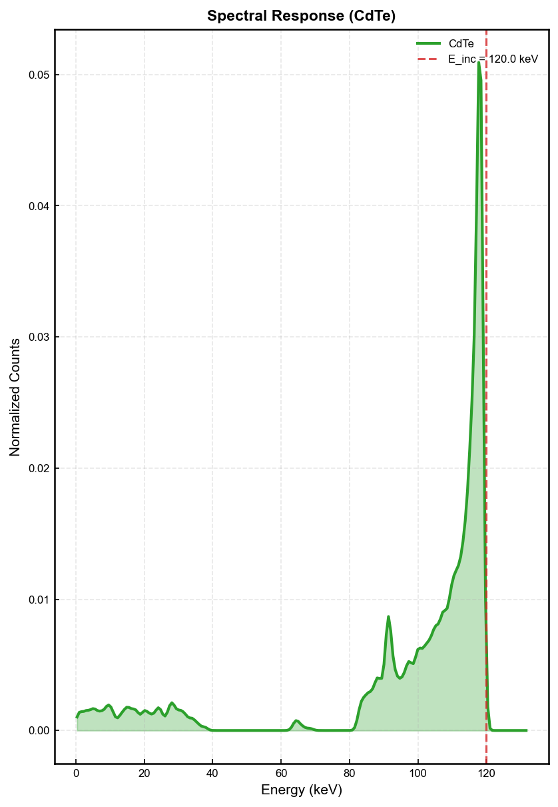 |
| Band structure (Fermi level) | 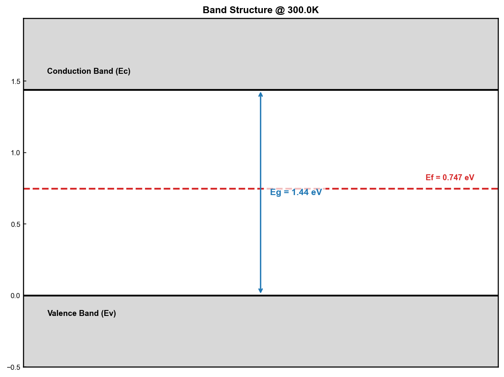 |
| Charge collection & internal field | 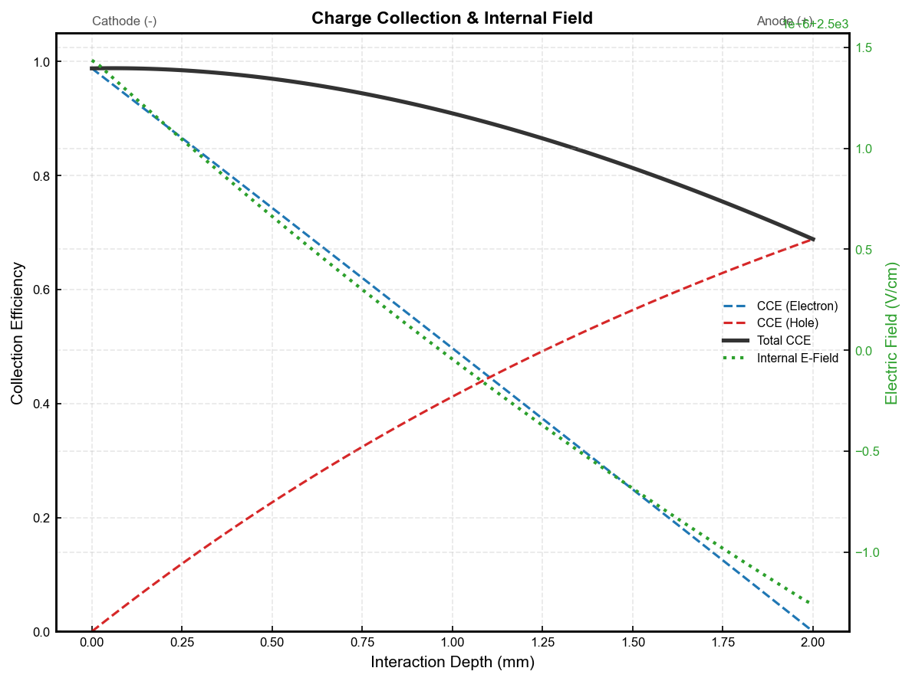 |
| Polarization effect | 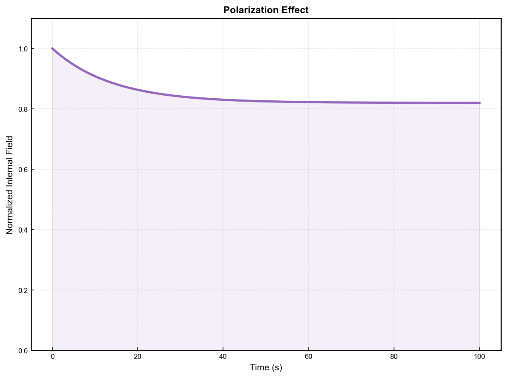 |
| X-ray attenuation (K-edges) | 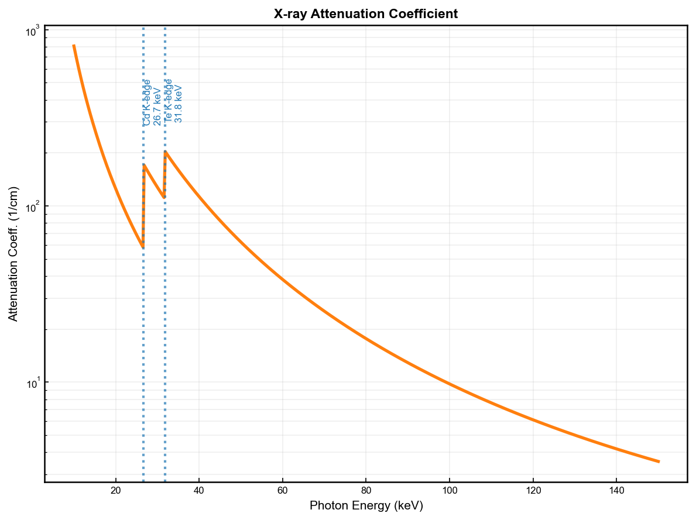 |
| Performance vs temperature | 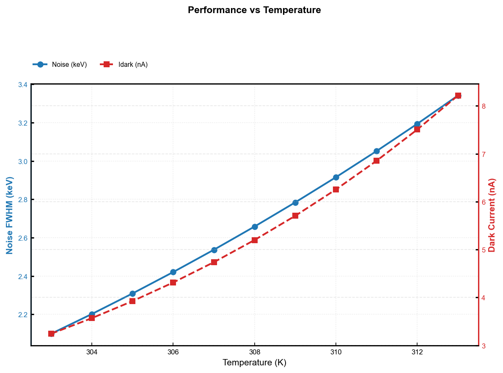 |
| Performance vs photon flux | 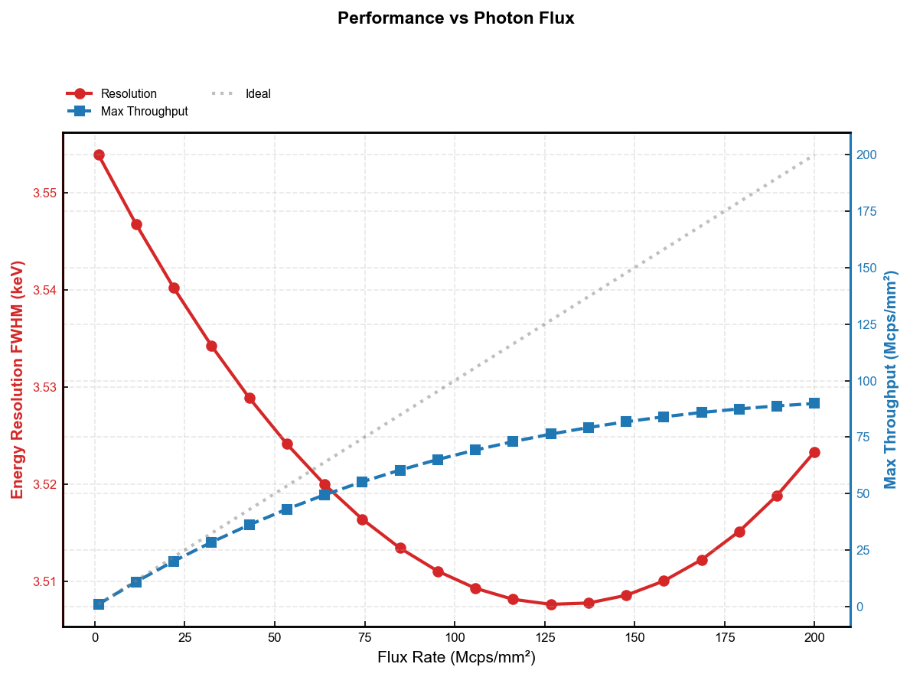 |

</details>

---

## Physics Models

| Module | Quantity | Model |
|--------|----------|-------|
| Fermi band | Intrinsic carriers | `n_i = sqrt(N_c·N_v)·exp(−E_g/2kT)` |
| Fermi band | Fermi level | `E_i = E_g/2 + (kT/2)·ln(N_v/N_c)` |
| Transport | Resistivity | `ρ = 1 / (q·n_i·(μ_e + μ_h))` |
| Transport | Dark-current shot noise | `σ = sqrt(2·q·I_dark·τ_int)` → ENC → FWHM |
| Transport | Charge collection | Hecht equation with drift lengths `λ = μτ·E` |
| Transport | Polarization | space-charge field distortion vs. time / flux |
| X-ray | Attenuation | NIST Xraylib `CS_Total_CP` (K-edge aware) |
| X-ray | Absorption efficiency | `1 − exp(−μ·d)` with depth-dependent interaction |
| X-ray | Spectral response | Monte-Carlo photopeak + Fano-limited Gaussian broadening |

The complete design write-up is in [`doc/design.md`](doc/design.md); the underlying scientific
background is collected in the [`kb/`](kb) knowledge base (Fermi integration, Ge & semiconductor
detectors, 40–190 keV band).

---

## Materials Library

Fermi ships with 9 built-in materials and can import more from a remote repository.

| Material | E_g (eV) | W (eV) | Density (g/cm³) | μτ(e) / μτ(h) |
|----------|---------:|-------:|----------------:|--------------:|
| Si       | 1.12 | 3.6 | 2.33 | high / high |
| Ge       | 0.66 | 2.96 | 5.32 | high / high |
| CdTe     | 1.44 | 4.43 | 5.85 | 3.3e-3 / 1.0e-4 |
| **CZT**  | 1.57 | 4.6 | 5.78 | 5.0e-3 / 4.0e-5 |
| TlBr     | 2.68 | 6.5 | 7.56 | 3.0e-4 / 4.0e-6 |
| HgI2     | 2.13 | 4.2 | 6.40 | 1.0e-4 / 4.0e-5 |
| GaAs     | 1.42 | 4.2 | 5.32 | 8.5e-2 / 4.0e-4 |
| Perovskite (MAPbI3) | 1.55 | 5.0 | 4.16 | 6.0e-5 / 6.0e-5 |
| 4H-SiC   | 3.26 | 7.8 | 3.21 | 9.5e-4 / 1.2e-4 |

Additional importable materials (GaAs, InP, Diamond, MAPbI3, HgI2) live in
[`data/remote_repo.json`](data/remote_repo.json).

---

## Installation

```powershell
git clone https://github.com/hg3992260/Fermi_PCCT.git
cd Fermi_PCCT

# create / activate an environment (example with conda)
conda create -n Fermi python=3.11 -y
conda activate Fermi
pip install -r requirements.txt
```

Dependencies ([`requirements.txt`](requirements.txt)): `numpy`, `matplotlib`, `PyQt6`, `xraylib`.

## Run the GUI

```powershell
python src/gui.py
# or, from the project root
conda run -n Fermi python I:\Fermi\src\gui.py
```

## Run from the command line

```powershell
python -m src.main --material CZT --energy 120 --temp 300 --bias 500 --thick 2.0 --output my_run
```

This writes `data/my_run_spectrum.csv` and `data/my_run_stats.json`.

---

## Building Desktop Apps

GitHub Actions build native binaries on every push or manual dispatch:

| Platform | Workflow | Artifact |
|----------|----------|----------|
| Windows  | [`.github/workflows/windows-build.yml`](.github/workflows/windows-build.yml) | `Fermi-windows` → `Fermi.exe` |
| macOS    | [`.github/workflows/macos-dmg.yml`](.github/workflows/macos-dmg.yml) | `Fermi-macos-dmg` → `Fermi.dmg` |

Download: repository **Actions** tab → select a run → **Artifacts**.

**macOS Gatekeeper note** — the DMG/App is not code-signed or notarized. Right-click → Open to
bypass, or run:

```bash
xattr -dr com.apple.quarantine /Applications/Fermi.app
```

### Icons

- Runtime window/taskbar icon: `resources/Atom.jpeg` (loaded in-app)
- Executable icon: `resources/Atom.ico` (PyInstaller `--icon`)

Regenerate the `.ico` with:

```powershell
python tools/make_ico.py
```

---

## Analysis Tools

The [`tools/`](tools) directory contains standalone report generators that reuse the same core
physics:

| Script | Purpose |
|--------|---------|
| `pcct_material_report_calc.py` | Rank all materials by a composite PCCT score across pixel pitches |
| `pcct_material_report_render.py` | Render the JSON report into Markdown/HTML |
| `pcct_polarization_compare.py` | Tabulate ΔFWHM flux-degradation across materials |
| `plot_polarization_curves.py` | Polarization field-strength curves (CdTe/CZT/Si/GaAs) |
| `make_ico.py` | Build the application icon |

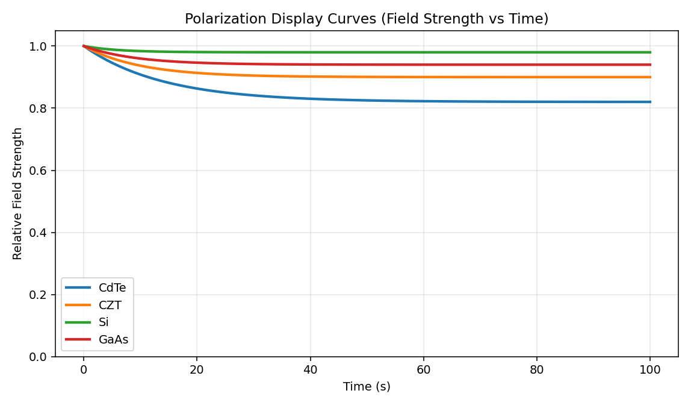

---

## Repository Structure

```
Fermi/
├── src/
│   ├── gui.py            # PyQt6 desktop application (main window, plots, i18n)
│   ├── simulator.py      # Detector + X-ray response integration (MC, Hecht, flux)
│   ├── physics.py        # Fermi-Dirac, resistivity, Hecht, K-edges, fallback xraylib
│   ├── material.py       # Material model + manager (load/save/import)
│   ├── monte_carlo.py    # Photon transport Monte-Carlo
│   ├── field_solver.py   # Internal electric-field / space-charge solver
│   ├── translations.py   # English / Chinese UI strings
│   └── main.py           # CLI entry point
├── data/                 # Material library, example spectra, remote repo
├── kb/                   # Scientific background knowledge base
├── doc/design.md         # Design document
├── tools/                # Standalone analysis & reporting scripts
├── resources/            # Icons (Atom.ico / Atom.jpeg)
├── docs/screenshots/     # README screenshots
└── .github/workflows/    # Windows + macOS packaging
```

---

## Credits

Developed by **Christ** — `Christ.paul90@gmail.com`.

Physics background adapted from the `kb/` knowledge base; X-ray cross-sections from the
[NIST Xraylib](https://github.com/tschoonj/xraylib) project.
